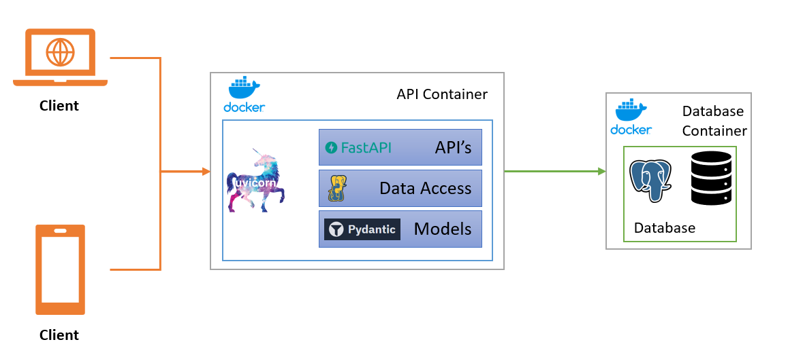

# Blog Code: Automating Backend Development with ChatGPT, FastAPI, and PostgreSQL

This repository contains code generated in reference to a blog where I used ChatGPT to generate SQL scripts and develop Backend API services. The code is written to run in PostgreSQL and utilizes FastAPI, psycopg3, and pydantic packages.

## API Services

The code provides three API services:

1. **Get Product by ID**: Retrieve product information by its unique ID.
2. **Get Product by SKU Number**: Retrieve product information using its SKU number.
3. **Get Products by Category**: Retrieve a list of products based on a specified category.

## System Diagram

The following diagram provides an overview of the system architecture:

## Deployment Instructions

To deploy the code, please follow the steps below:

1. Download the code from this repository.
2. Make sure you have the latest version of Docker installed and running on your machine.
3. Open a terminal or command prompt in the project directory.
4. Run the `deploy.ps1` script if you're using Windows.

The deployment script will set up the necessary Docker containers and configure the environment for the Backend API services.

**Note**: If you're using a different operating system, you can just copy paste the command from the ps1 file and run it on your terminal.

## Requirements

To run the code locally, you will need the following:

- Python 3.7 or above
- PostgreSQL database
- Docker (for deployment)

## Contributing

Contributions are welcome! If you find any issues or have suggestions for improvements, please create a new issue or submit a pull request.

## License

This code is released under the [GNU GPL License](LICENSE). Feel free to use and modify it as per your needs.

## Acknowledgements

Special thanks to ChatGPT for assisting in generating the SQL scripts and code for this project.
For any further details, please refer to the blog post associated with this repository.
